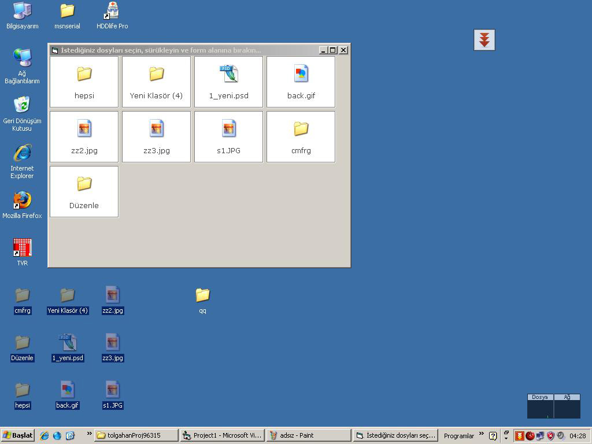



## VB Shortcut

### Description

This sample shows you following technics:

OLE Drag and Drop,

User Controls (own controls),

Windows API s,

Creating simple but strong buttons,

Running any file without Shell function,

Extracting icons from any file,

Drawing Icons,

Drawing Texts,

and more etc...

I wrote this for beginners and intermediates just for a base.. so improve it...
 
### More Info
 

             |
---                |---
**Submitted On**   |2007-04-08 04:31:48
**By**             |[Tolgahan ALBAYRAK](https://github.com/Planet-Source-Code/PSCIndex/blob/master/ByAuthor/tolgahan-albayrak.md)
**Level**          |Intermediate
**User Rating**    |4.8 (38 globes from 8 users)
**Compatibility**  |VB 6\.0
**Category**       |[Coding Standards](https://github.com/Planet-Source-Code/PSCIndex/blob/master/ByCategory/coding-standards__1-43.md)
**World**          |[Visual Basic](https://github.com/Planet-Source-Code/PSCIndex/blob/master/ByWorld/visual-basic.md)
**Archive File**   |[VB\_Shortcu205900482007\.zip](https://github.com/Planet-Source-Code/tolgahan-albayrak-vb-shortcut__1-68306/archive/master.zip)

